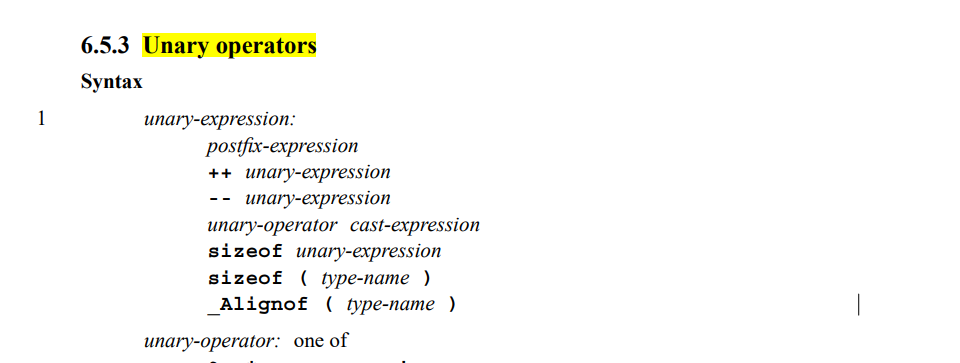

# C语言解决error expected parentheses around type name in sizeof expression问题

## 背景

在union中使用sizeof编译报错

## 问题代码片段

```c++
#include <stdio.h>

void byteOrder()
{
    union 
    {
        short value;
        char union_bytes[sizeof short];
    } test;

    test.value = 0x0102;

    if ( (test.union_bytes[0] == 1) && (test.union_bytes[1] == 2) )
    {
        printf("big endian\n");
    }
    else if ( (test.union_bytes[0] == 2) && (test.union_bytes[1]) == 1 )
    {
        printf("little endian\n");
    }
    else 
    {
        printf("unkown...\n");
    }
}

int main()
{
    byteOrder();
    
    return 0;
}
```

## 解决方案

```C++
#include <stdio.h>

void byteOrder()
{
    union 
    {
        short value;
        char union_bytes[sizeof(short)];
    } test;

    test.value = 0x0102;

    if ( (test.union_bytes[0] == 1) && (test.union_bytes[1] == 2) )
    {
        printf("big endian\n");
    }
    else if ( (test.union_bytes[0] == 2) && (test.union_bytes[1]) == 1 )
    {
        printf("little endian\n");
    }
    else 
    {
        printf("unkown...\n");
    }
}

int main()
{
    byteOrder();
    
    return 0;
}
```

## 问题原因



sizeof是一个运算符，用于计算任何数据类型和表达式的大小，当操作数是表达式时，可以省略括号；当sizeof后面是类型名称的时候必须加上括号。

## 参考资料：

[C标准规范](https://web.cs.dal.ca/~vlado/pl/C_Standard_2011-n1570.pdf)

