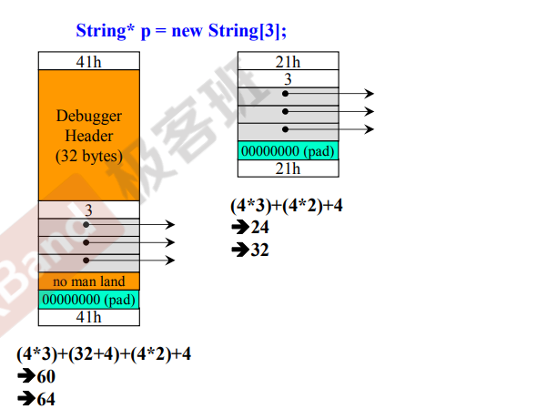
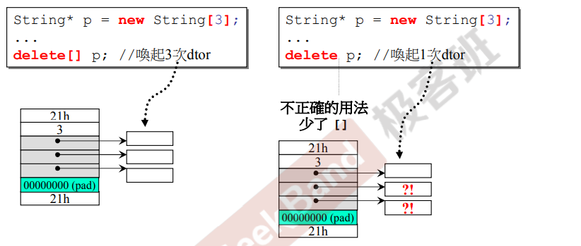

# C语言解决free invalid pointer 导致的core dumped问题引发的思考

## 背景

在公司的项目中，编译运行后出来free invalid pointer的问题，导致程序运行直接段错误。

## 出现问题的代码片段

```c
#include <stdio.h>
#include <stdlib.h>
#include <string.h>

int main() {
	char * test_data = (char*)malloc(24);
	if (test_data == NULL) {
		printf("test data malloc failed\n");
		return 0;
	}
	
	bzero(test_data, 24);
	
	char test[] = "HelloT1mzhouCSDNTEST";
	strcpy(test_data, test);
	
	char buf[24];
	for (int i = 0; i < 24; i++) {
		buf[i] = *test_data++;
	}
	
	free(test_data);
	test_data = NULL;

	return 0;
}
```

## 解决方案

```c
#include <stdio.h>
#include <stdlib.h>
#include <string.h>

int main() {
	char* test_data = (char*)malloc(24);
	if (test_data == NULL) {
		printf("test data malloc failed\n");
		return 0;
	}
	
	bzero(test_data, 24);
	
	char test[] = "HelloT1mzhouCSDNTEST";
	strcpy(test_data, test);
	
	char buf[24];
	char* tmp =  test_data;	// 使用临时指针指向malloc的空间
	for (int i = 0; i < 24; i++) {
		buf[i] = *tmp++;	// 数据操作使用tmp指针
	}
	
	free(test_data);
	test_data = NULL;

	return 0;
}
```

## 为什么需要这样处理？

### glibc-2.2.3源码

```c
/* Declaration changed to standard one for GNU.  */
void *
malloc(size)
	register size_t size;
{
	register int i, n;
	register free_list_t fl;
	register header_t h;

	if ((int) size < 0)		/* sanity check */
		return 0;
	size += HEADER_SIZE;
	/*
	 * Find smallest power-of-two block size
	 * big enough to hold requested size plus header.
	 */
	i = 0;
	n = MIN_SIZE;
	while (n < size) {
		i += 1;
		n <<= 1;
	}
	ASSERT(i < NBUCKETS);
	fl = &malloc_free_list[i];
	spin_lock(&fl->lock);
	h = fl->head;
	if (h == 0) {
		/*
		 * Free list is empty;
		 * allocate more blocks.
		 */
		more_memory(n, fl);
		h = fl->head;
		if (h == 0) {
			/*
			 * Allocation failed.
			 */
			spin_unlock(&fl->lock);
			return 0;
		}
	}
	/*
	 * Pop block from free list.
	 */
	fl->head = HEADER_NEXT (h);

#ifdef MCHECK
	assert (HEADER_CHECK (h) == CHECK_FREE);
	HEADER_CHECK (h) = CHECK_BUSY;
#endif

#ifdef	DEBUG
	fl->in_use += 1;
#endif	/* DEBUG */
	spin_unlock(&fl->lock);
	/*
	 * Store free list pointer in block header
	 * so we can figure out where it goes
	 * at free() time.
	 */
	HEADER_FREE (h) = fl;
	/*
	 * Return pointer past the block header.
	 */
	return ((char *) h) + HEADER_SIZE;
}

/* Declaration changed to standard one for GNU.  */
void
free(base)
	void *base;
{
	register header_t h;
	register free_list_t fl;
	register int i;

	if (base == 0)
		return;
	/*
	 * Find free list for block.
	 */
	h = (header_t) (base - HEADER_SIZE);

#ifdef MCHECK
	assert (HEADER_CHECK (h) == CHECK_BUSY);
#endif

	fl = HEADER_FREE (h);
	i = fl - malloc_free_list;
	/*
	 * Sanity checks.
	 */
	if (i < 0 || i >= NBUCKETS) {
		ASSERT(0 <= i && i < NBUCKETS);
		return;
	}
	if (fl != &malloc_free_list[i]) {
		ASSERT(fl == &malloc_free_list[i]);
		return;
	}
	/*
	 * Push block on free list.
	 */
	spin_lock(&fl->lock);
	HEADER_NEXT (h) = fl->head;
#ifdef MCHECK
	HEADER_CHECK (h) = CHECK_FREE;
#endif
	fl->head = h;
#ifdef	DEBUG
	fl->in_use -= 1;
#endif	/* DEBUG */
	spin_unlock(&fl->lock);
	return;
}
```

我们很显然能看到`malloc`申请的空间返回的地址偏移了`HEADER_SIZE`个字节，这意味着实际我们申请出来的空间是大于我们实际所申请的空间大小。

`malloc`的头部信息记录在`header_t`这个结构中。我们查看该结构体内容

```c
typedef union header {
	union header *next;
	struct free_list *fl;
} *header_t;


typedef struct free_list {
	spin_lock_t lock;	/* spin lock for mutual exclusion */
	header_t head;		/* head of free list for this size */
#ifdef	DEBUG
	int in_use;		/* # mallocs - # frees */
#endif	/* DEBUG */
} *free_list_t;

```

我们可以看出头部记录了内存的使用情况。

接着我们看`free`源码

我们转入需要释放的空间时，会向前偏移`HEADER_SIZE`个字节才能正确找到需要释放空间的地址；这也是我们为什么需要用`tmp`变量去做实际的数据操作。这种操作时为了保证`free`传入的指针地址没有偏移。释放时，`free`能根据该地址偏移进而正确释放申请空间。

## 扩展话题

### C++中new一个数组，使用delete释放会怎么样？

* ### 以VC为例子

  #### 

  #### 图示说明：

  * 第一个内存分布图，是`VC debug`模式下，申请3个`String`对象数组后动态分配的内存情况；

  * 第二个内存分布图，是`VC release`版本下，申请3个`String`对象数组后动态分配的内存情况；

  **图一解释：**41h为动态内存申请后vc标记动态申请内存的大小，41h为64的16进制数据+1，1为标识内存被使用。橘黄色的部分为`Debug`需要的信息，`Debugger header`为`debug`的头部信息。3为申请的数组大小。`pad`为填充数据，最后大小为64是因为内存对齐。

  **图二解释：**21h为动态内存申请后vc标记动态申请内存的大小，21h为32的16进制数据+1，1为标识内存被使用。3为申请的数组大小。最后大小为32是因为内存对齐。

  *****

  

  **由左图可以看出**：动态申请`String`数组后，使用`delete[]`,能正确调用析构函数对内存进行释放；

  **由右图可以看出**：动态申请`String`数组后，如何使用`delete`区释放内存，只会调用一次析构函数，剩下的2块动态申请的空间会内存泄漏；

* C++中new一个空间，使用delete []释放会怎么样？

## 参考资料

[glibc-2.2.3源码]([Index of /gnu/glibc](http://ftp.gnu.org/gnu/glibc/))

侯捷CPP-面向对象高级编程课件

